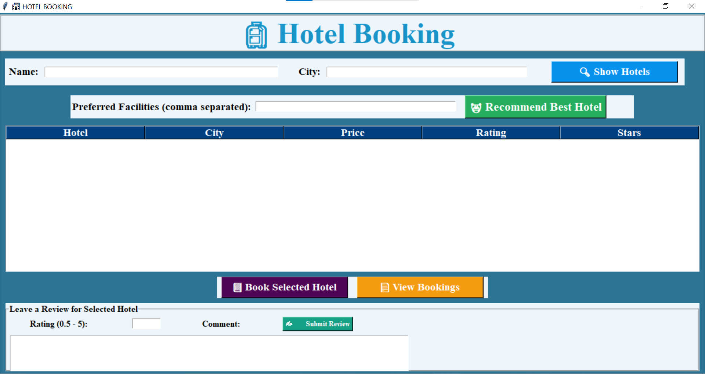

# 🏨 Smart Hotel Booking And Recommendation System


## 📌 Project Overview
The Smart Hotel Booking and Recommendation System is an AI-powered desktop application developed using Python and Tkinter. It helps users find and book hotels based on their preferences such as city, budget, and desired facilities.

The system uses machine learning techniques like cosine similarity to provide personalized hotel recommendations, making the booking process smarter and more efficient.

---

## 🚀 Key Features
- 🔍 Search hotels by city
- 🤖 AI-based hotel recommendation system
- 🏨 Book hotels with user details
- ⭐ Review and rating system
- 📊 Dynamic rating updates based on user feedback
- 💾 Data storage using CSV files
- 🖥️ User-friendly GUI built with Tkinter

---
## 🛠️ Tech Stack

| Category        | Technology Used |
|----------------|----------------|
| **Language**        | Python 🐍 |
| **GUI Framework**   | Tkinter |
| **Data Handling**   |**Libraries Used:** | Pandas, NumPy |
| **Machine Learning** | Scikit-learn (Cosine Similarity, MultiLabelBinarizer)|

---


## 🧠 How the Recommendation System Works
- Hotel data is processed and converted into structured feature vectors
- Facilities are encoded using **MultiLabelBinarizer**   
- User preferences (facilities, city) are encoded  
- Numerical features like price, rating, and stars are normalized 
- Cosine similarity is applied to match user preferences with most relevant hotels 
- System recommends top hotels based on similarity scores  

---

📂 Project Structure
Smart-Hotel-Booking-And-Recommendation-System/
│
├── smart_hotel_booking_ai_full.py   # Main application
├── hotels.csv                       # Hotel dataset (optional)
├── bookings.csv                     # Booking data (auto-generated)
├── reviews.csv                      # Reviews data (auto-generated)
└── README.md

## ▶️ How to Run the Project

### 1️⃣ Install Dependencies
```bash
pip install pandas numpy scikit-learn

2️⃣ Run the Application
python smart_hotel_booking_ai_full.py


## 📸 Screenshots

### 🏠 Home Screen
![Home]

### 🔍 Hotel Listings
![Hotels]

### 🤖 AI Recommendations
![AI]

### 📘 Booking Confirmation
![Booking]


5️⃣ ⭐ Review System
![Review]


💡 Future Enhancements
🌐 Convert to web application using Flask/Django
🔐 Add user authentication (Login/Signup)
💳 Integrate online payment system
📱 Develop mobile application
📊 Add analytics dashboard for insights


🎯 Use Cases
Travelers looking for personalized hotel recommendations
Smart tourism and travel planning applications
Educational project demonstrating machine learning + GUI integration


🌟 Highlights
Combines Machine Learning + GUI Application
Real-world use case implementation
Beginner-friendly yet impactful project


🤝 Contribution
Contributions are welcome! Feel free to fork the repository and submit a pull request.


📜 License
This project is open-source and available under the MIT License.


👩‍💻 Author

Harshpreet Kaur
B.Tech CSE Student (2027)
Aspiring Software / AI Engineer

🔗 GitHub: https://github.com/harshpreetkaur1012-web


<p align="center"> ⭐ If you like this project, don't forget to star the repository! </p> ```