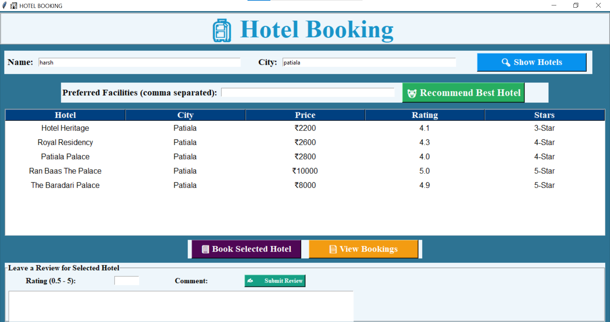
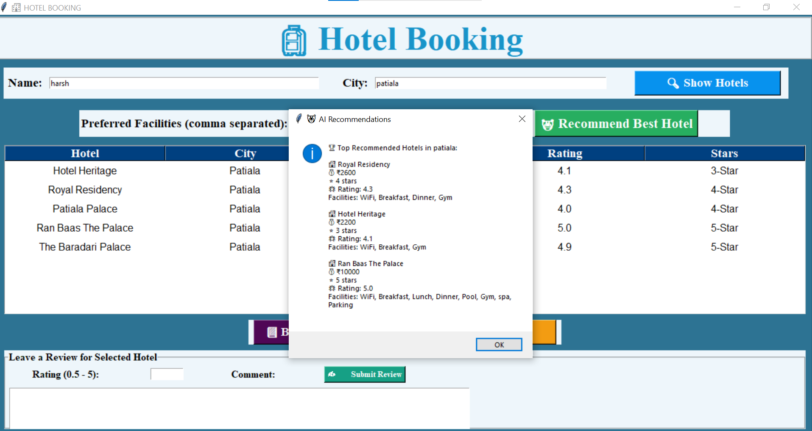
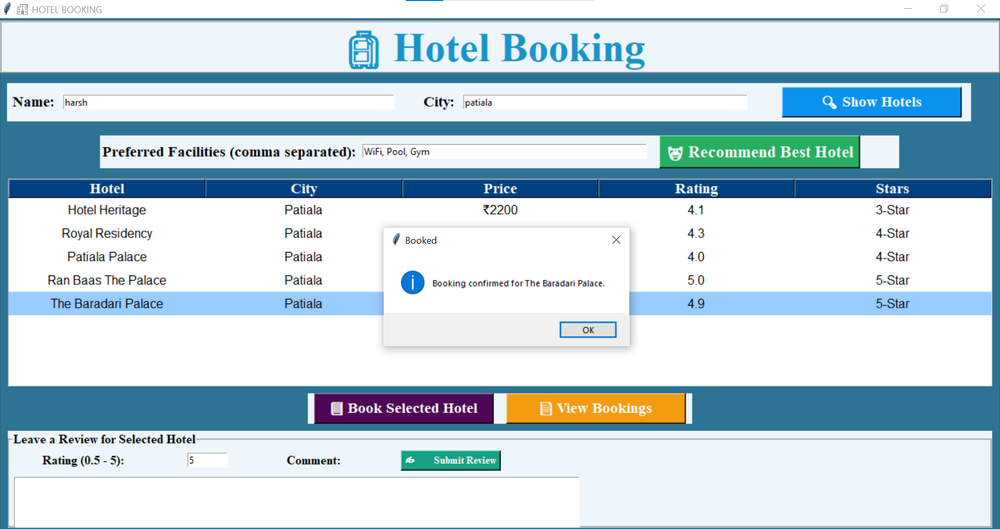
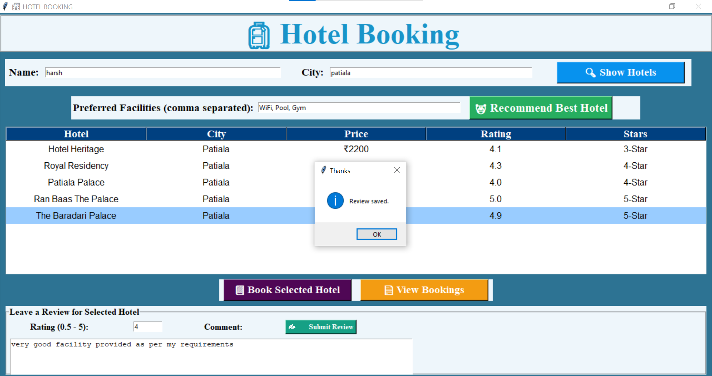

<div align="center">

# 🏨 Smart Hotel Booking & Recommendation System

An AI-Powered Hotel Recommendation Desktop Application built with **Python**, **Tkinter**, and **Scikit-learn**.


</div>

------

# 🌟 Project Highlights

- 🤖 AI-powered hotel recommendation engine
- 🧠 Content-Based Filtering using Cosine Similarity
- 🏨 Smart hotel booking management
- ⭐ Review & rating system
- 🖥️ Desktop GUI with Tkinter
- 📊 Machine Learning using Scikit-learn
- 🎥 Complete project demo on YouTube

---

# 🎥 Project Demonstration

<p align="center">

<a href="https://www.youtube.com/watch?v=gmmRfq1quE0">


</a>

</p>

<p align="center">

▶️ Click the image above to watch the complete project demonstration.

</p>

---

# 📖 About

The **Smart Hotel Booking & Recommendation System** is a desktop application that combines a traditional hotel booking workflow with an intelligent recommendation engine.

Instead of displaying random hotels, the application analyzes user preferences and hotel facilities using **Content-Based Filtering**. Hotel amenities are encoded using **MultiLabelBinarizer**, similarity scores are calculated using **Cosine Similarity**, and the best matching hotels are recommended.

This project demonstrates practical applications of Machine Learning, Python GUI development, and data processing in the travel domain.

---

# ✨ Features

- 🔍 Search hotels by city
- 🤖 AI-powered hotel recommendations
- 🏨 Hotel booking
- 📖 Booking history
- ⭐ Review & rating system
- 📈 Dynamic rating updates
- 💾 CSV-based storage
- 🖥️ Tkinter desktop interface

---

# 🔄 Application Workflow

```text
                 START
                   │
                   ▼
        Launch Desktop Application
                   │
                   ▼
Enter Name • City • Preferred Facilities
                   │
                   ▼
          Search Available Hotels
                   │
                   ▼
     Recommendation Engine (ML Model)
                   │
      Content-Based Filtering
                   │
     MultiLabelBinarizer Encoding
                   │
       Cosine Similarity Matching
                   │
                   ▼
       Display Best Matching Hotels
                   │
        User Selects a Hotel
                   │
                   ▼
           Confirm Booking
                   │
         Save Booking to CSV
                   │
                   ▼
        Submit Rating & Review
                   │
      Dynamic Rating Update
                   │
                   ▼
                 END
```

# 🤖 Machine Learning Pipeline

```text
User Preferences
      │
      ▼
Feature Extraction
      │
      ▼
MultiLabelBinarizer
      │
      ▼
Feature Matrix
      │
      ▼
Cosine Similarity
      │
      ▼
Top Matching Hotels
      │
      ▼
Booking & Reviews
```


**Algorithms & Libraries**

- Content-Based Filtering
- Cosine Similarity
- MultiLabelBinarizer
- Scikit-learn
- Pandas
- NumPy

---

# 🛠️ Tech Stack

| Category | Technology |
|-----------|------------|
| Language | Python |
| GUI | Tkinter |
| Machine Learning | Scikit-learn |
| Data Processing | Pandas, NumPy |
| Storage | CSV |

---

# 📊 Project Statistics

| Category | Details |
|-----------|---------|
| Project Type | Desktop Application |
| Domain | Travel & Hospitality |
| Recommendation System | Content-Based Filtering |
| Language | Python |
| GUI Framework | Tkinter |
| ML Library | Scikit-learn |
| Data Processing | Pandas & NumPy |
| Storage | CSV |

---

# 📸 Screenshots

## 🏠 Home


---

## 🔎 Hotel Search



---

## 🤖 Recommendation



---

## ✅ Booking Confirmation



---

## ⭐ Review System



---

# 📂 Project Structure

```text
Smart-Hotel-Booking-And-Recommendation-System
│
├── assets/
│   └── banner.png
├── Screenshots/
├── data/
│   ├── bookings.csv
│   └── reviews.csv
├── hotel_booking.py
├── requirements.txt
├── README.md
├── LICENSE
└── .gitignore
```

---

# 🚀 Getting Started

## Clone

```bash
git clone https://github.com/harshpreetkaur1012-web/Smart-Hotel-Booking-And-Recommendation-System.git
cd Smart-Hotel-Booking-And-Recommendation-System
```

## Install

```bash
pip install -r requirements.txt
```

## Run

```bash
python hotel_booking.py
```

---

# 💡 Future Roadmap

- User authentication
- Online payments
- Hotel image gallery
- Cloud database
- Flask/Django web version
- Mobile application
- Admin dashboard
- Analytics

---

# 📚 Learning Outcomes

- Recommendation Systems
- Content-Based Filtering
- Feature Engineering
- Cosine Similarity
- MultiLabelBinarizer
- Python GUI Development
- Data Processing
- Software Design

---

# 👩‍💻 Author

**Harshpreet Kaur**

B.Tech Computer Science Engineering (2027)

- GitHub: https://github.com/harshpreetkaur1012-web
- LinkedIn: https://www.linkedin.com/in/harshpreetkaur1012/

---

# 🤝 Contributing

Contributions, suggestions, and improvements are welcome. Feel free to fork the repository and submit a pull request.

---

# 📜 License

This project is licensed under the MIT License.

---

# ⭐ Support

If you found this project useful, please consider giving it a ⭐ Star.

For feedback or suggestions, feel free to open an issue or connect with me on LinkedIn.
